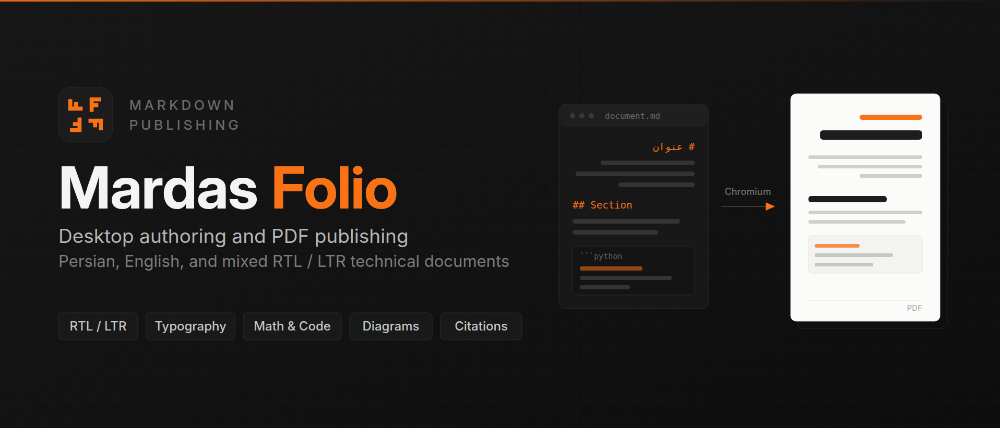

# Mardas Folio

> Desktop Markdown authoring and publishing for Persian, English, and mixed RTL/LTR technical documents

    

## Overview

This repository contains **Mardas Folio**, a Markdown authoring and PDF publishing application for Persian, English, and mixed-language technical documents. It combines a native desktop editor with a local rendering engine that turns single documents or ordered multi-file books into print-ready PDF files.

The system is built around a browser-based rendering pipeline. Markdown is parsed and normalized, converted into a complete HTML document carrying appearance CSS, cover metadata, contents, and print rules, and finally rendered by Chromium under Playwright control. Everything runs on the local machine: no document is uploaded, and normal workflows require no network access.

```text
Markdown -> Structured HTML -> Chromium PDF
```

The project ships three process interfaces around one engine — a native desktop application, a command-line interface for automation, and a JSON-RPC sidecar that the desktop shell speaks to over standard streams.



## Features

- **Bidirectional typography.** Per-line direction detection, Persian-aware fonts and punctuation grouping, and separate control of document language and document direction.
- **Desktop authoring.** A CodeMirror 6 editor that renders formatting in place, with callouts, tables, task checkboxes, images, collapsed front matter, and code-language chips shown as the engine will publish them.
- **True-to-output preview.** The export screen composes the real published page — cover, contents, watermark, running footer — on sheets of the configured size with the configured margins, paginated by the document's own page-break rules.
- **Complete option surface.** All 53 publishing options are exposed in a searchable, categorised settings browser; every option carries a one-sentence explanation and inherits from the project file when left untouched.
- **Book projects.** Ordered multi-file books with namespaced identifiers, cross-chapter links, one contents, one bibliography, and a single PDF artifact.
- **Semantic numbering.** Deterministic figure, table, equation, and listing numbers with `@fig:`, `@tbl:`, `@eq:`, and `@lst:` cross-references and generated lists.
- **Offline citations.** Local BibTeX and CSL JSON sources resolved to author-date or numeric citations with a generated bibliography and no network lookup.
- **Rich Markdown.** GitHub-flavoured syntax, MathJax formulas, offline Mermaid flowchart diagrams, enhanced code blocks with titles and line highlighting, footnotes, callouts, and bounded local images.
- **PDF navigation.** Outline bookmarks, internal link destinations, page labels, and running footers that stay consistent after cover and content merging.
- **Publication quality gates.** A strict profile that fails instead of silently degrading when maths, fonts, or navigation cannot be produced, with a structured JSON evidence report.

## Architecture

### Markdown processing

The Markdown layer handles front matter, heading collection, contents and PDF outline generation, GitHub-style task lists and alerts, autolinks, heading anchors, image captions, enhanced code blocks, Mermaid diagrams, extended callouts, footnotes, safe HTML, local image embedding with blocked placeholders, print-fit wide tables, math protection, and direction-aware metadata. It normalizes captions for images, tables, listings, and diagrams so the PDF layer can keep a caption with its block.

The reference engine assigns stable numbers and destinations to labelled objects and resolves semantic references before bidi isolation. The citation engine loads bounded local sources, resolves citations after book assembly, and generates one linked bibliography.

### PDF rendering

The renderer builds the printable HTML, validates page size and margins, applies the selected style, palette, and mode, typesets MathJax, separates the cover from numbered content pages, applies watermarks, writes PDF metadata and bookmarks, adds page labels and running footers, and exports through Chromium.

Print-flow rules keep headings with their first block, protect paragraphs from orphan and widow lines, and let long code blocks or large tables split only when avoiding the split would waste a page. Both navigation layers — the visible contents and the viewer outline — resolve to the same heading destinations after metadata writing and cover merging.

### Interfaces

| Interface | Command | Purpose |
| :--- | :--- | :--- |
| Desktop application | — | Native authoring workspace, book projects, and PDF export |
| Command line | `folio` | Automation, CI, and scripted publishing |
| Browser GUI | `folio-gui` | Local single-document and project workspace in a browser |
| Sidecar | `folio-sidecar` | Versioned JSON-RPC over standard streams for desktop clients |

The sidecar opens no localhost port, reports progress, and supports cooperative cancellation. JSON-RPC messages use `stdout`; operational logs use `stderr`. Architecture decisions and the protocol contract live under [`docs/architecture/`](./docs/architecture/).

### Document safety

Saving is conflict-aware. Every write carries the revision the document was opened at, so when a file changes outside the application the save is refused and the conflict is reported instead of overwriting the external edit. Unsaved buffers are kept in per-document recovery snapshots and offered back after an unexpected exit. The editor is the bundled CodeMirror 6 build; if it cannot start, the workspace degrades to a plain `textarea` that keeps saving, recovery, and export working rather than leaving the user with no editor at all.

## Quick Start

### Desktop application

Download the package for your operating system from the [Releases](https://github.com/mragetsars/Mardas-Folio/releases) page. Each package embeds the rendering runtime, including Python and a pinned Chromium, so no separate installation is required.

| Platform | Package |
| :--- | :--- |
| Windows 11 or Server 2019+ | `Mardas-Folio-X.Y.Z-windows-x86_64-setup.exe` |
| macOS 14+ (Apple Silicon or Intel) | `Mardas-Folio-X.Y.Z-macos-arm64.dmg`, `-macos-x86_64.dmg` |
| Linux x86-64 (built on Ubuntu 22.04) | `Mardas-Folio-X.Y.Z-linux-x86_64.AppImage`, `.deb` |

#### Opening a release that is not yet code-signed

These packages are not signed with a Windows Authenticode certificate or an
Apple Developer ID yet, so Windows and macOS will warn that the publisher cannot
be verified. The warning is about the absence of a paid publisher certificate,
not about the contents of the package. Every release artifact is checksummed and
attested, and [Release Verification](#release-verification-and-offline-bundles)
describes how to confirm you have the file this repository built.

- **Windows** — SmartScreen shows "Windows protected your PC". Choose **More
  info**, then **Run anyway**.
- **macOS** — Gatekeeper reports that the application "cannot be opened because
  the developer cannot be verified". Open the DMG, drag the application to
  `/Applications`, then right-click it and choose **Open**, and confirm **Open**
  in the dialog. Double-clicking it will not offer that choice.
- **Linux** — unaffected; there is no publisher-trust prompt. Mark the AppImage
  executable with `chmod +x` before running it.

### Command line

```bash
git clone https://github.com/mragetsars/Mardas-Folio.git
cd Mardas-Folio
python -m venv .venv
source .venv/bin/activate
pip install -e .
python -m playwright install chromium
```

Render a PDF:

```bash
folio input.md -o output.pdf --toc --style modern --palette emerald --mode light
```

Validate a document, inspect resolved configuration, and diagnose the environment without opening Chromium:

```bash
folio init
folio validate input.md
folio explain-config input.md
folio doctor input.md
```

The nearest `mardas.toml` is discovered from the document directory upward. Command-line options override project values, which override equivalent front-matter values.

Build an ordered multi-file book:

```bash
folio init my-book --book
folio validate-book my-book
folio build-book my-book
```

Enable the strict publication profile for thesis, journal, and release artifacts. It fails instead of degrading when MathJax remains unresolved, a required font is unavailable, or PDF navigation cannot be preserved:

```bash
folio input.md -o output.pdf \
  --quality-profile strict-publication \
  --require-font Vazirmatn \
  --quality-report build/output-quality.json
```

Mardas Folio does not redistribute font binaries; install the required families locally or point `--font-dir` at trusted font files.

Number figures, tables, equations, and listings and reference them semantically:

```toml
[references]
enabled = true
numbering_scope = "chapter"
list_of_figures = true
```

```markdown
See @fig:architecture for the processing pipeline.


*Figure. Processing architecture.* {#fig:architecture}
```

Audit source accessibility and inspect a finished PDF:

```bash
folio audit-accessibility report.md
folio audit-book-accessibility path/to/book
folio audit-pdf dist/book.pdf --profile all
```

The complete option reference, including citations, branding, watermarks, and appearance, is in the guides.

### Browser workspace

The browser GUI opens a single document, or a real on-disk project:

```bash
folio-gui
folio-gui --project path/to/project
```

Project Workspace mode adds a project file tree, chapter badges, a Problems panel backed by the same diagnostics as the CLI, renderer-backed preview, and full-book preview and export. Saves use content hashes and atomic replacement, so a stale edit is rejected rather than overwriting an external change. **Open Bundle** and **Save Bundle** handle portable `.mardas.json` snapshots containing Markdown, export options, and attached assets; those are separate from the live project opened with `--project`.

### Building the runtime from source

Release engineering builds the portable rendering runtime on its target operating system, then verifies the frozen executable, its SHA-256 manifest, the bundled browser, and a Unicode-path render:

```bash
python -m pip install -e '.[desktop]'
python -m playwright install chromium --only-shell
python scripts/build_standalone_runtime.py --clean
python scripts/verify_standalone_runtime.py \
  build/standalone-runtime/Mardas-Folio-2.0.1-runtime-linux-x86_64 \
  --render
```

The desktop shell lives under `apps/desktop/`. Its offline frontend is built and integrity-checked with `scripts/build_desktop_frontend.py` and `scripts/verify_desktop_frontend.py`.

## Repository Structure

The project is organized as follows:

```text
Mardas-Folio/
├── src/mardas_folio/          # Python publishing engine
│   ├── markdown.py             # Parsing, front matter, contents, math, Mermaid, footnotes, safe HTML
│   ├── renderer.py             # HTML assembly, appearance CSS, MathJax, Chromium PDF rendering
│   ├── references.py           # Numbered objects, labels, cross-references, generated lists
│   ├── citations.py            # Offline BibTeX/CSL JSON parsing and bibliography output
│   ├── book.py                 # Chapter manifest, namespacing, cross-links, book assembly
│   ├── application.py          # Application API shared by the CLI and the sidecar
│   ├── sidecar.py              # Stdio JSON-RPC process for the desktop client
│   ├── protocol.py             # Versioned JSON-RPC envelope and error contract
│   ├── cli.py                  # Conversion command-line interface
│   ├── config.py               # mardas.toml discovery, validation, and resolution
│   ├── workspace.py            # Bounded project tree, file I/O, preview, and book export
│   ├── gui.py                  # Local browser-based GUI backend
│   └── assets/                 # Style sheets, GUI shell, logos, and vendored MathJax
├── apps/desktop/               # Native desktop application
│   ├── src-tauri/              # Rust shell, window, native dialogs, sidecar lifecycle
│   ├── frontend/               # Application interface, export preview, workspace
│   ├── editor-src/             # CodeMirror 6 editor sources bundled into the frontend
│   └── tests/                  # Node test suite for the interface contracts
├── docs/                       # Guides, architecture decisions, release and security policy
│   └── guides/                 # Complete English and Persian user guides
├── examples/                   # Generated PDF outputs of the guides
├── packaging/                  # PyInstaller entrypoint and frozen-runtime specification
├── schemas/                    # Versioned sidecar JSON-RPC schemas
├── scripts/                    # Checks, distributions, runtime builds, visual QA
├── tests/                      # Python test suite
├── assets/readme/              # Repository landing artwork
├── .github/workflows/          # Continuous integration and release automation
├── pyproject.toml              # Package metadata and dependencies
├── LICENSE                     # MIT license
└── README.md                   # Project overview and usage
```

## Documentation

Mardas Folio uses a guide-first documentation model; the guides are both the user manual and a live rendering sample.

- [English Guide](./docs/guides/GUIDE.en.md) — complete English manual.
- [راهنمای فارسی](./docs/guides/GUIDE.fa.md) — complete Persian/RTL manual.
- [Documentation map](./docs/README.md) — index for release, maintenance, security, and documentation policy.

Generated PDF versions of both guides are in [`examples/`](./examples/). They also serve as release-facing print samples during typography and media audits.

Operations references: [Changelog](./docs/CHANGELOG.md), [Release checklist](./docs/RELEASE.md), [Maintenance workflow](./docs/MAINTENANCE.md), [Distribution](./docs/DISTRIBUTION.md), [Updates](./docs/UPDATES.md), [Security policy](./docs/SECURITY.md), [Release signing](./docs/RELEASE_SIGNING.md), and [Documentation policy](./docs/DOCUMENTATION.md).

## Release Verification and Offline Bundles

Tagged releases are verified on Linux, Windows, and macOS. The workflow builds deterministic wheel and source distributions, an SPDX 2.3 SBOM, platform-specific offline Python wheel bundles, the frozen sidecar runtime, and the native desktop packages, then stages a GitHub draft release. A source checkout is not evidence that those target-platform jobs, installer smoke tests, signing, or notarization completed for a particular release.

Verify a downloaded release directory before installing:

```bash
sha256sum -c CHECKSUMS.sha256
python scripts/finalize_release_artifacts.py \
  --artifact-dir . \
  --version X.Y.Z \
  --require-sbom \
  --verify-only
```

Official artifacts can also be checked against their signed provenance:

```bash
gh attestation verify mardas_folio-X.Y.Z-py3-none-any.whl \
  --repo mragetsars/Mardas-Folio
```

An offline Python bundle is installed from its extracted directory with `python install.py --target mardas-folio-venv`. The installer verifies the embedded checksums and invokes pip with `--no-index`; PDF rendering still requires a compatible Chromium executable.

## Testing

```bash
pip install -e .[dev]
./scripts/check.sh                     # Ruff, scoped Pyright, and the Python suite
npm --prefix apps/desktop test         # Desktop interface contracts
npm --prefix apps/desktop run check:editor   # Committed editor bundle matches its sources
```

The Python suite covers Markdown transformation, direction handling, contents and outline generation, code highlighting, Mermaid rendering, MathJax preservation, callouts, safe HTML, footnotes, image boundaries, renderer options, page-size handling, wide-table fitting, workspace persistence, appearance validation, the sidecar protocol, and packaging contracts. The Node suite covers the export option schema, page geometry and pagination, editor commands, preview security, and interface state.

Before tagging a release, run the consolidated gate rather than the individual commands:

```bash
./scripts/release_gate.sh
```

Continuous integration runs the full suite on Linux, Windows, and macOS across Python 3.10 through 3.13, plus a wheel-render smoke that produces a Unicode-path mixed RTL/LTR PDF from the built wheel on all three systems.

## Security Model

Mardas Folio is a local publishing tool. Local Markdown images and front-matter branding logos are resolved relative to the document, restricted to supported regular image files inside that document root, and embedded before Chromium renders. Out-of-bound paths, symlink escapes, unsupported files, and oversized images are rejected or drawn as visible blocked placeholders.

Remote `http(s)` images are blocked by default; `--allow-remote-assets` opts in for trusted documents. Raw HTML is sanitized unless `--unsafe-html` is used. Bibliography sources are bounded local files and citation rendering performs no network lookup. Chromium sandboxing is configurable with `--chromium-sandbox auto|on|off`. Output files are written atomically, and the CLI rejects input, output, and debug paths that resolve to the same file.

See [docs/SECURITY.md](./docs/SECURITY.md) for the full trust boundary.

## Limitations

- Accessibility and PDF audits are readiness checks. The project does **not** claim PDF/UA or PDF/A conformance without an independent standards validator, and Chromium output is not tagged.
- Desktop packages are code-signed and notarized only when a release is built with the corresponding credentials. An unsigned package will show an operating-system warning on first launch.
- Font binaries are not redistributed. Persian output expects Vazirmatn or a comparable family to be installed locally.
- The Linux AppImage is built and tested on Ubuntu 22.04. Newer glibc distributions may work, but that is the published acceptance baseline.
- Equations are typeset by MathJax during export; the editor's export preview shows their source and reports how many are pending.

## Contributors

This project was developed and maintained by:

- **[Meraj Rastegar](https://github.com/mragetsars)**

## License

This project is licensed under the MIT License. See [LICENSE](./LICENSE) for details.
